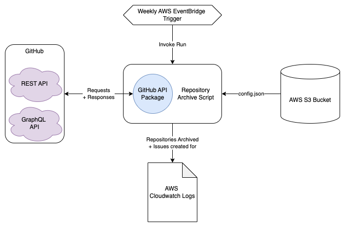

# Overview

## Scope

The script focuses on repositories within the ONSdigital GitHub organisation - although configurable to work with any GitHub organisation. The tool is designed to run periodically and with minimal manual intervention.

The script provides a range of benefits within the organisation, including:

- **Less overhead**: Reduces the number of repositories that need to be maintained.
- **Improved discoverability**: Makes it easier for users to find active projects.
- **Organisational cleanliness**: Helps keep the GitHub organisation tidy and organised.
- **Improved security**: Reduces the risk of security vulnerabilities in outdated repositories.
- **Improved performance**: Less active repositories makes it easier to collect repository information from the GitHub API.

## Architecture

The Archive Script is a single Python script which gets executed periodically within AWS Lambda. The script collects live organisation information from the GitHub API, checks each repository against a set of criteria, and archives/creates issues for repositories that meet the criteria.

The below diagram illustrates the architecture of the Repository Archive Script:

## Getting Started

To get started with the Repository Archive Script, follow the steps within the project's [README](https://github.com/ONS-Innovation/github-repository-archive-script/blob/main/README.md).

## Additional Information

For more detailed information about the Repository Archive Script, refer to the following documents:

- [The Process](./the_process.md)
- [Exemption Process](./exemption_process.md)
- [Configuration](./configuration.md)
- [Notification Issue](./notification_issue.md)
- [Logging](./logging.md)

## Documentation

For information about this MkDocs site, refer to the [Documentation](./documentation.md) page.
