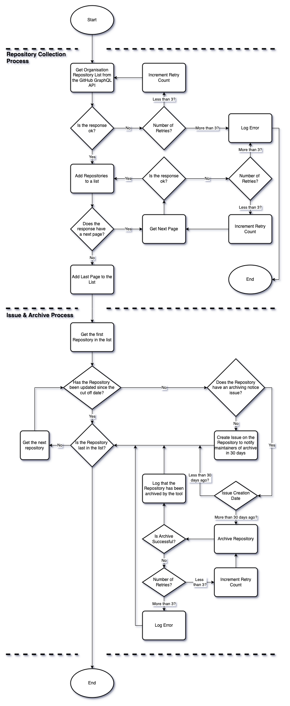

# The Process

## Steps in the Process

### 1. Data Collection

Using the GitHub API, collect all non-archived repositories for a given organisation (ONSdigital).

This includes the repository's name, when it was last updated and the number of open issues with the notification issue label (defined within the configuration - see [Configuration](./configuration.md)).

### 2. Data Processing

Iterate through each repository and check the following:

TODO: Finish process write up

## Process Flow Chart

